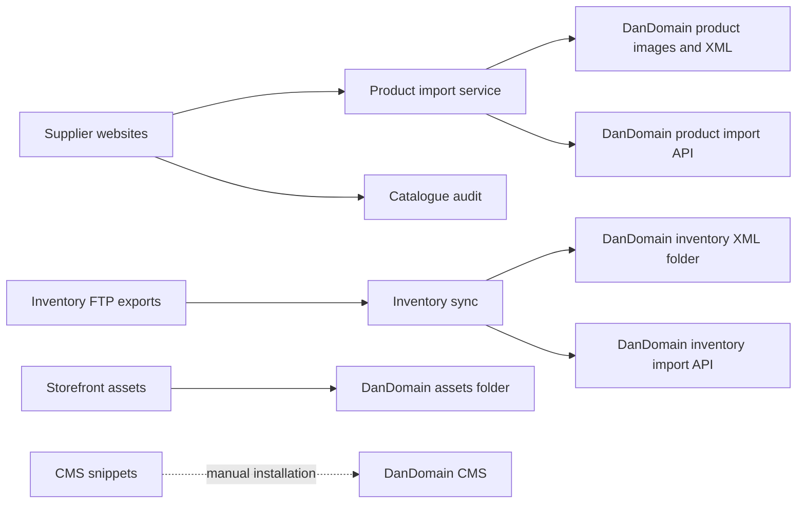

# Repository architecture

This repository is the monorepo for Handicapmidler.dk integrations, storefront assets, CMS snippets, and operational utilities. The paths below describe the repository before the restructuring moves begin. Operational ownership has not yet been assigned; each component must have an owner before its migration is approved.

## System context

## Production components

### Product import

- **Current path:** `services/product-import-service`
- **Target path:** `services/product-import`
- **Purpose:** Scrape a supplier product page, let an operator review the product, generate DanDomain product XML and image variants, and optionally upload/import them.
- **Owner:** Unassigned.
- **Runtime:** Python 3.12/FastAPI in Docker Compose; production host is a 64-bit DietPi/Raspberry Pi with private access through Tailscale Serve.
- **Invocation:** Operator-driven web UI. Deployment is a manual Git pull followed by a production Compose rebuild.
- **Inputs:** Supplier URL, operator-edited product fields, category export, environment configuration, and remote supplier images.
- **Outputs:** Persistent files under `data/`, four JPEG variants per enabled image, product XML, FTP uploads to `/images/products/` and `/images/ImportExport/Products/Updated/`, and a DanDomain import request.
- **Secrets:** `AUTH_PASSWORD_HASH`, FTP credentials, and DanDomain API credentials in a server-only `.env` file. Do not commit `.env`.
- **Behavioral boundary:** Dry-run is the default. Enabling upload also requires authentication.

### Inventory synchronization

- **Current path:** `scripts/InventoryService`
- **Target path:** `services/inventory-sync`
- **Purpose:** Convert supplier stock and movement exports into DanDomain inventory XML and trigger an update-only import.
- **Owner:** Unassigned.
- **Runtime:** .NET 8 console application on a GitHub-hosted Ubuntu runner.
- **Invocation:** `.github/workflows/inventory-workflow.yml`, manually or every day at 16:00 UTC.
- **Inputs:** FTP files `VARER.LST`, `LAGERBEHOLD.LST`, and `LAGERBEVAEG.LST`, plus `exclude.txt`.
- **Outputs:** `data/document.xml`, currently uploaded together with everything else under `data/` to `images/ImportExport/Inventory/Updated/`, followed by an update-only DanDomain import request.
- **Secrets:** GitHub Actions secrets `ftp_server`, `ftp_username`, `ftp_password`, `api_upload_endpoint`, `api_username`, and `api_password`.
- **Known migration constraints:** Input/output paths depend on the process working directory, and the exclusion path is separately hard-coded.

### Storefront assets

- **Current path:** `deploy`
- **Target path:** `storefront/assets`
- **Purpose:** Maintain the JavaScript and CSS automatically deployed to the webshop.
- **Owner:** Unassigned.
- **Runtime:** GitHub Actions using `devatherock/minify-js:1.0.3` and `SamKirkland/FTP-Deploy-Action@4.2.0`.
- **Invocation:** A push to `main` changing `deploy/**`, or manual workflow dispatch.
- **Inputs:** `deploy/javascripts.js` and `deploy/styles.css`.
- **Outputs:** `javascripts.min.js` and `styles.min.css`, synchronized to the unchanged remote `assets/` destination.
- **Secrets:** GitHub Actions secrets `ftp_server`, `ftp_username`, and `ftp_password`.

## Supported operational tools

### Catalogue audit

- **Current path:** `scripts/product-scraper`
- **Target path:** `tools/catalog-audit`
- **Purpose:** Scrape Mobilex catalogue pages and report products missing from a DanDomain product export. This is a catalogue-gap audit, not the single-product import workflow.
- **Owner:** Unassigned.
- **Runtime/invocation:** Manually executed Python scripts using Selenium, Chrome, pandas, and webdriver-manager.
- **Inputs:** Hard-coded Mobilex category starting URLs and an exported product XML file.
- **Outputs:** Generated Mobilex and missing-product CSV reports.
- **Secrets:** None identified.
- **Known migration constraint:** Both scripts reference the nonexistent relative path `productService/generated`; the tool is not currently reproducible without manual path correction.

### Referral reporting

- **Current path:** `scripts/statistics`
- **Target path:** `tools/reporting/referrals`
- **Purpose:** Aggregate order referrer domains and display a chart.
- **Owner:** Unassigned.
- **Runtime/invocation:** Manually executed Python script using pandas, matplotlib, and seaborn.
- **Inputs:** Semicolon-delimited `referrals.csv` containing at least `REFERRER`.
- **Outputs:** Interactive bar chart.
- **Secrets:** None identified, but order exports may contain sensitive production data and must not be committed.
- **Known migration constraint:** The input path is hard-coded relative to the repository root.

### Manual image preparation

- **Current path:** `compress.sh`
- **Target path:** `tools/image-prep`
- **Purpose:** Manually trim images, convert them to JPEG, and make the four webshop image variants.
- **Owner:** Unassigned.
- **Runtime/invocation:** Manual POSIX shell script requiring ImageMagick's `magick` command and Caesium CLI's `caesiumclt` command.
- **Inputs:** Images placed in `./Compress/`.
- **Outputs:** JPEG variants in `./Compressed/` named `name-p.jpg`, `name.jpg`, `name-r.jpg`, and `name-t.jpg`.
- **Secrets:** None.
- **Safety:** The script recursively deletes all content under `./Compress/` after processing. The Pillow implementation in product import is authoritative for automated imports.

## Reference and manually managed content

### CMS snippets

- **Current path:** `static`
- **Target path:** `storefront/cms-snippets/review` until each snippet is verified, then optionally `storefront/cms-snippets/active`.
- **Purpose:** HTML, CSS, and JavaScript manually copied into DanDomain CMS locations.
- **Owner:** Unassigned.
- **Invocation:** Manual review and installation in DanDomain; no automated deployment exists.
- **Inputs/outputs:** Repository snippets are copied to an as-yet undocumented CMS page, template, or component location.
- **Secrets:** DanDomain administrator access, managed outside this repository.
- **Control:** `docs/CMS-MANIFEST.md` is the source of truth for review status. No file is considered active merely because its name does not contain `backup`.

### Brand source

- **Current path:** `graphics/handicapmidler.svg`
- **Target path:** `storefront/brand` only if its current use is confirmed.
- **Purpose:** Candidate vector logo/brand source.
- **Owner:** Unassigned.
- **Status:** Unverified; no automated consumer was identified.

### Reference exports and inventory samples

- **Current paths:** Root `export.xml`, root `export-sample-all-fields.xml`, and `inventory/`.
- **Target paths:** `reference/dandomain` and `reference/inventory`.
- **Purpose:** Examples of DanDomain XML and supplier inventory formats.
- **Owner:** Unassigned.
- **Control:** Production exports and supplier snapshots must be removed or sanitized before they are retained as fixtures.
